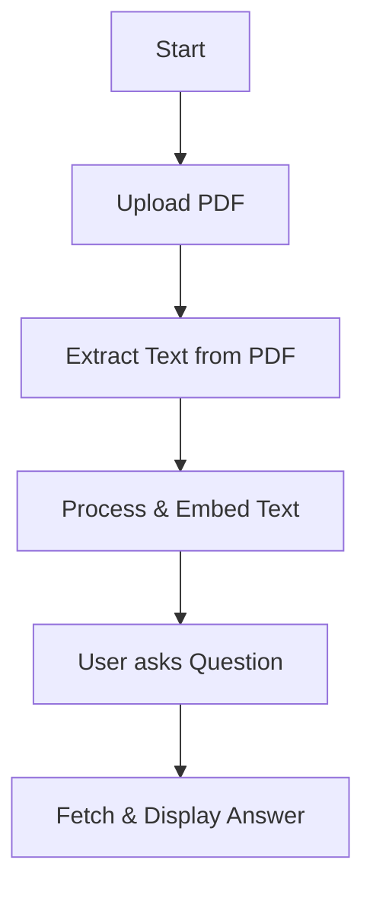

# AskPDF 📄💬

An interactive Language Model-powered chatbot application that enables users to delve deep into their PDFs. Built with the power of Streamlit, LangChain, and OpenAI.

## 🌟 Overview

AskPDF is a chatbot that consumes a user-uploaded PDF, processes its text, and engages the user in a Q&A session about the content of the PDF. Dive into your documents and uncover insights with ease!

## ✨ Features

- 📤 Upload a PDF and extract its text.
- 💬 Interactive chat interface to ask questions.
- 🧠 Uses embeddings for swift content lookup.
- 🚀 Built leveraging Streamlit, LangChain, and OpenAI.

## 📋 Prerequisites

Ensure these libraries are set up:

- Streamlit
- streamlit_extras
- PyPDF2
- LangChain (and its modules)
- OpenAI
- dotenv
- pickle (Standard Python Library)
- os (Standard Python Library)

## 🔧 Setup & Installation

1. 📥 Clone the repository:
   ```bash
   git clone https://github.com/bcthakre/GenAIPDF.git
2. 🚀 Move to the repository directory:
    ```bash
    cd <repository-directory>
3. 🛠 Install necessary packages:
    ```bash
    pip install -r requirements.txt
4. 🎉 Launch the Streamlit app:
    ```bash
    streamlit run app.py

## 📘 Usage

1. 🖥 Open the app in your browser.
2. 📄 Drag and drop a PDF file.
3. ❓ Pose your questions regarding the PDF content.

##  App Flow Diagram

